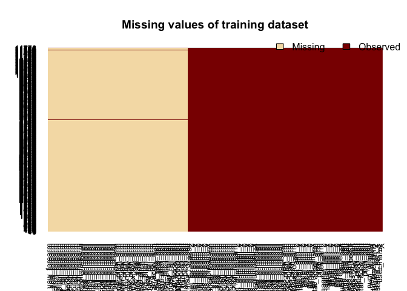
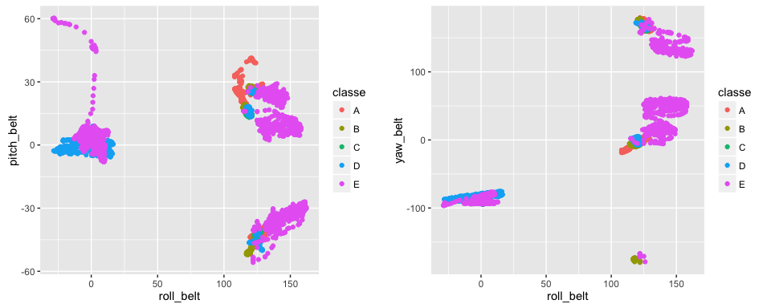

# Practical Machine Learning, Coursera Final Project
Jose Lao  
6 de July de 2016  

<br><br>

# INTRO

This is the final project of the **Practical Machine Learning** of Coursera Course. In this project we have to model statistical algorithms using some data from accelerometers on the belt, forearm, arm, and dumbell of 6 participants in order to predict the activity data they do. The **outcome** is the activity data that is classified into five different activities. so this is a classification modelling exercise.

The training data for this project are available here: (https://d396qusza40orc.cloudfront.net/predmachlearn/pml-training.csv)
The test data are available here: (https://d396qusza40orc.cloudfront.net/predmachlearn/pml-testing.csv)
The data for this project come from this source: (http://groupware.les.inf.puc-rio.br/har).


<br><br>

# DOWNLOADING AND READING DATA

Here I will download and read the data. Because test data is very small (20 records) I will assign test data as ***validation*** data set and I split training data into training and test data sets about (60% and 40%).


```r
training <- read.csv("pml-training.csv")

# splitting training data into training and testing data sets
library(caret)
set.seed(0)
training.id <- createDataPartition(training$classe, p=0.6, list=FALSE)
training <- training[training.id,]
testing <- training[-training.id,]

# reading testing data as validation data set
validation <- read.csv("pml-testing.csv")
```


```r
dim(training)
```

```
## [1] 11776   160
```

```r
dim(testing)
```

```
## [1] 4727  160
```

```r
dim(validation)
```

```
## [1]  20 160
```

```r
table(training$classe)
```

```
## 
##    A    B    C    D    E 
## 3348 2279 2054 1930 2165
```

<br><br>

# CHECK FOR DATA INTEGRATION

I will check if there are columns with a lot of NAs:


```r
library(Amelia)
missmap(training, main = "Missing values of training dataset")
```

<!-- -->

```r
# count and percentage of the number of NAs by column
training.NA <- data.frame(var = colnames(training), NAs_num = sapply(training, 
    function(y) sum(is.na(y))), NAs_perc = sapply(training, function(y) paste0(round(sum(is.na(y))/NROW(y) * 
    100, 2), "%")))

ToEliminatebyNA <- subset(training.NA, training.NA$NAs_num > 0)
head(ToEliminatebyNA)
```

```
##                                       var NAs_num NAs_perc
## max_roll_belt               max_roll_belt   11518   97.81%
## max_picth_belt             max_picth_belt   11518   97.81%
## min_roll_belt               min_roll_belt   11518   97.81%
## min_pitch_belt             min_pitch_belt   11518   97.81%
## amplitude_roll_belt   amplitude_roll_belt   11518   97.81%
## amplitude_pitch_belt amplitude_pitch_belt   11518   97.81%
```

I eliminate these columns (with a lot of NA values):


```r
eliminate.cols1 <- which(colnames(training) %in% ToEliminatebyNA$var)
training <- training[,-eliminate.cols1]
testing <- testing[,-eliminate.cols1]
```

Then I will check if there is near zero variability variables:


```r
# check if there is nearZero Variability variables
nsv <- nearZeroVar(training)
# these variables has low/zero variability, so maybe it can be eliminated
ToEliminatebyNSV <- colnames(training)[nsv]
ToEliminatebyNSV
```

```
##  [1] "new_window"              "kurtosis_roll_belt"     
##  [3] "kurtosis_picth_belt"     "kurtosis_yaw_belt"      
##  [5] "skewness_roll_belt"      "skewness_roll_belt.1"   
##  [7] "skewness_yaw_belt"       "max_yaw_belt"           
##  [9] "min_yaw_belt"            "amplitude_yaw_belt"     
## [11] "kurtosis_roll_arm"       "kurtosis_picth_arm"     
## [13] "kurtosis_yaw_arm"        "skewness_roll_arm"      
## [15] "skewness_pitch_arm"      "skewness_yaw_arm"       
## [17] "kurtosis_roll_dumbbell"  "kurtosis_picth_dumbbell"
## [19] "kurtosis_yaw_dumbbell"   "skewness_roll_dumbbell" 
## [21] "skewness_pitch_dumbbell" "skewness_yaw_dumbbell"  
## [23] "max_yaw_dumbbell"        "min_yaw_dumbbell"       
## [25] "amplitude_yaw_dumbbell"  "kurtosis_roll_forearm"  
## [27] "kurtosis_picth_forearm"  "kurtosis_yaw_forearm"   
## [29] "skewness_roll_forearm"   "skewness_pitch_forearm" 
## [31] "skewness_yaw_forearm"    "max_yaw_forearm"        
## [33] "min_yaw_forearm"         "amplitude_yaw_forearm"
```

I eliminate columns with near zero variability:


```r
eliminate.cols2 <- which(colnames(training) %in% ToEliminatebyNSV)
training <- training[,-eliminate.cols2]
testing <- testing[,-eliminate.cols2]
```

Our problem is for movement classification, so variables like: "**X**", "**user_name**", or these related with time: "**raw_timestamp_part_1**", "**raw_timestamp_part_2**", "**cvtd_timestamp**" or "**num_window**" doesn't make sense to include in the algorithm. So I eliminate these:


```r
training$X <- NULL; testing$X <- NULL;
training$user_name <- NULL; testing$user_name <- NULL;
training$raw_timestamp_part_1 <- NULL; testing$raw_timestamp_part_1 <- NULL;
training$raw_timestamp_part_2 <- NULL; testing$raw_timestamp_part_2 <- NULL;
training$cvtd_timestamp <- NULL; testing$cvtd_timestamp <- NULL;
training$num_window <- NULL; testing$num_window <- NULL;
```


The final dimensions are:


```r
dim(training)
```

```
## [1] 11776    53
```

```r
dim(testing)
```

```
## [1] 4727   53
```


<br><br>

# SOME PLOTS


```r
library(ggplot2)
library(gridExtra)
plot1 <- qplot(roll_belt,pitch_belt,colour=classe, data=training)
plot2 <- qplot(roll_belt,yaw_belt,colour=classe, data=training)
grid.arrange(plot1, plot2, ncol=2)
```

<!-- -->

<br><br>

# START MODELLING

At now I can start to model and predict, I will use different models and configurations (like cross-validation, etc..) in order to see which model performs better in the test data set. The **outcom** is the the **"classe"** variable. I will use the other variables to predict that.

First of all I set the computer to make parallel computing for caret functions:


```r
# Configuring parallel processing for caret functions
library(parallel)
library(doParallel)
cluster <- makeCluster(detectCores()-1)
registerDoParallel(cluster)
```


<br>

## Model "rpart" with cross-validation


```r
# MODELLING
fitControl <- trainControl(method="cv", number=10, allowParallel=TRUE)
set.seed(0)
modelFit <- train(classe ~ ., data=training, preProcess=NULL,
                  method="rpart", trControl=fitControl)

# PREDICTION
modelPred <- predict(modelFit, testing)
confusionMatrix(modelPred, testing$classe)$table
```

```
##           Reference
## Prediction    A    B    C    D    E
##          A 1212  370  390  344  124
##          B   21  324   24  116  115
##          C  106  217  430  284  232
##          D    0    0    0    0    0
##          E    4    0    0    0  414
```

```r
confusionMatrix(modelPred, testing$classe)$overall['Accuracy']
```

```
##  Accuracy 
## 0.5034906
```

<br>

## Model "rainbow forest" with cross-validation


```r
# MODELLING
fitControl <- trainControl(method="cv", number=10, allowParallel=TRUE)
set.seed(0)
modelFit <- train(classe ~ ., data=training, preProcess=NULL,
                  method="rf", trControl=fitControl)

# PREDICTION
modelPred <- predict(modelFit, testing)
confusionMatrix(modelPred, testing$classe)$table
```

```
##           Reference
## Prediction    A    B    C    D    E
##          A 1343    0    0    0    0
##          B    0  911    0    0    0
##          C    0    0  844    0    0
##          D    0    0    0  744    0
##          E    0    0    0    0  885
```

```r
confusionMatrix(modelPred, testing$classe)$overall['Accuracy']
```

```
## Accuracy 
##        1
```

<br>

## Model h2o Rainbow forest

Now I will try to model with h2o package, that requires some especial data treatment:


```r
library(h2o)
h2o.init(max_mem_size="3g", nthreads=4)
```


```r
# converting data to h2o class
train_h2o <- as.h2o(training)
test_h2o <- as.h2o(testing)
y.id <- which(colnames(train_h2o) == "classe")
x.id <- which(colnames(train_h2o) != "classe")

# MODELLING
set.seed(0)
modelFit <- h2o.randomForest(x=x.id, y=y.id, training_frame=train_h2o,
                              ntrees=50, max_depth=50)
# PREDICTION
modelPred <- as.data.frame(h2o.predict(modelFit, test_h2o))$predict
```


```r
confusionMatrix(modelPred, testing$classe)$table
```

```
##           Reference
## Prediction    A    B    C    D    E
##          A 1343    0    0    0    0
##          B    0  911    0    0    0
##          C    0    0  844    0    0
##          D    0    0    0  744    0
##          E    0    0    0    0  885
```

```r
confusionMatrix(modelPred, testing$classe)$overall['Accuracy']
```

```
## Accuracy 
##        1
```


<br><br>

# SELECTING MODEL

The results above indicates that rpart model is not so good, and rainbow forest with caret and with h2o are the two good models  for this classification problem, so I decided to use h2o-rainbow forest model for final prediction because is faster than caret version.

## MODELLING TRAINING FULL DATA SET FOR TEST VALIDATION

Once I have selected the model, I join the train and test data in order to get a best model for improve accuracy on validation data set:


```r
# joining train and test data set for final model
trainingFINAL <- rbind(training, testing)

# consoliding validation table with same predictor columns as training data set
validation <- validation[,-eliminate.cols1]
validation <- validation[,-eliminate.cols2]
```


```r
# converting data to h2o class
trainFINAL_h2o <- as.h2o(trainingFINAL)
validation_h2o <- as.h2o(validation)
y.id <- which(colnames(trainFINAL_h2o) == "classe")
x.id <- which(colnames(trainFINAL_h2o) != "classe")

# MODELLING
set.seed(0)
modelFitFINAL <- h2o.randomForest(x=x.id, y=y.id, training_frame=trainFINAL_h2o,
                              ntrees=50, max_depth=50)

# Importance of variables
as.data.frame(cbind(modelFitFINAL@model$variable_importances$variable,
                    modelFitFINAL@model$variable_importances$scaled_importance))
```

## PREDICTION ON VALIDATION DATA SET

And for the final QUIZ I obtained these prediction on the validation data set:


```r
# PREDICTION ON VALIDATION
modelPredVALID <- as.data.frame(h2o.predict(modelFitFINAL, validation_h2o))$predict
```


Plotting the validation data set:


```r
plot1 <- qplot(roll_belt,pitch_belt, color=modelPredVALID, data=validation)
plot2 <- qplot(roll_belt,yaw_belt, color=modelPredVALID, data=validation)
grid.arrange(plot1, plot2, ncol=2)
```

<!-- -->

<br><br>
